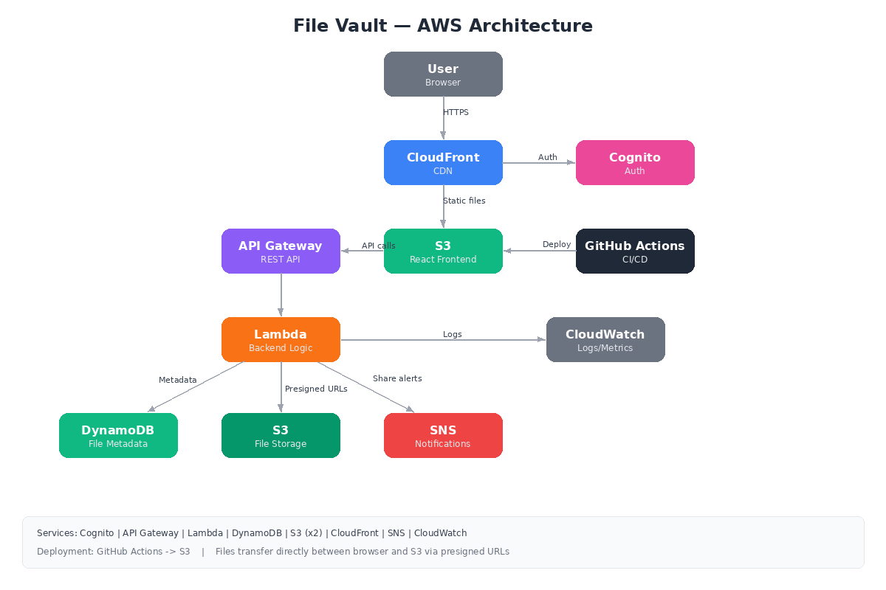

# File Vault

A secure file storage and sharing app built on AWS for CS 1660 (Intro to Cloud Computing). Users can sign up, upload files, organize them into folders, and share files with time-limited links. Shared file recipients get an email notification via SNS.

## Quick Setup

1. Clone the repo and install dependencies:
```
git clone https://github.com/Equinox2005/file-vault.git
cd file-vault
npm install
```

2. Open `src/config.js` and plug in your Cognito User Pool ID, Client ID, and API Gateway URL.

3. Run locally:
```
npm start
```

Pushing to `main` triggers GitHub Actions to build and deploy to S3 automatically.

## How It Works

The frontend is a React single-page app hosted on S3 and served through CloudFront. When a user signs up, Cognito handles the whole auth flow (email verification, password hashing, JWT tokens). Once logged in, the app talks to a REST API through API Gateway, which forwards everything to a single Lambda function.

The Lambda function handles all the backend logic. File metadata (names, sizes, folder structure, S3 keys) is stored in DynamoDB. The actual files live in a separate private S3 bucket. Uploads and downloads go directly between the browser and S3 using presigned URLs, so Lambda never touches the file bytes. This is important because Lambda has a 6MB payload limit, but presigned URLs let users upload files up to 5GB.

When someone shares a file, Lambda generates a presigned URL with a custom expiration (anywhere from 1 hour to 7 days) and publishes a notification through SNS, which sends the recipient an email with the download link.

CloudWatch picks up all Lambda logs automatically for monitoring and debugging.

## AWS Services (8)

- Cognito -- user authentication and session management
- API Gateway -- REST API with Cognito authorizer
- Lambda -- serverless backend (Python)
- DynamoDB -- stores file and folder metadata
- S3 -- file storage (private bucket) and frontend hosting (public bucket)
- CloudFront -- CDN for the frontend, provides HTTPS
- SNS -- email notifications when files are shared
- CloudWatch -- logging and monitoring

## Why These Services

I went with Lambda over EC2 because the workload is event-driven and low-traffic. No point paying for an idle server. DynamoDB made more sense than RDS since im just doing key-value lookups by user ID, not complex joins. S3 presigned URLs were the right call for file transfers because it offloads the heavy lifting from Lambda and avoids the payload size limit. I used SNS instead of SES for share notifications because SNS is simpler to set up for occasional emails and I didn't need the bulk email features SES provides.

## Architecture



## Deployment

GitHub Actions handles CI/CD. Every push to main runs `npm run build` and syncs the output to the S3 frontend bucket. The workflow is in `.github/workflows/deploy.yml`.

## AI Usage

Claude was used to help write the Lambda function code, React frontend, and GitHub Actions workflow. All AWS services were configured manually through the console.

## Video Demo

(https://www.youtube.com/watch?v=kyhEKiumfJA)

## Team

- Hamza Al Ebousi
